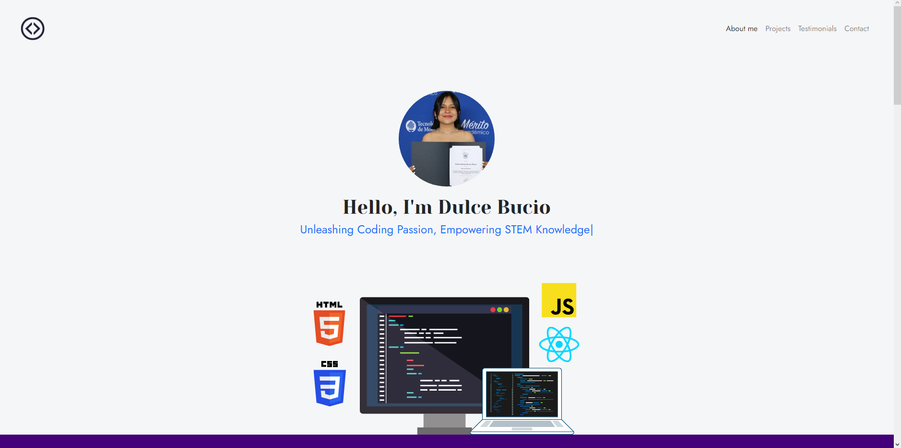
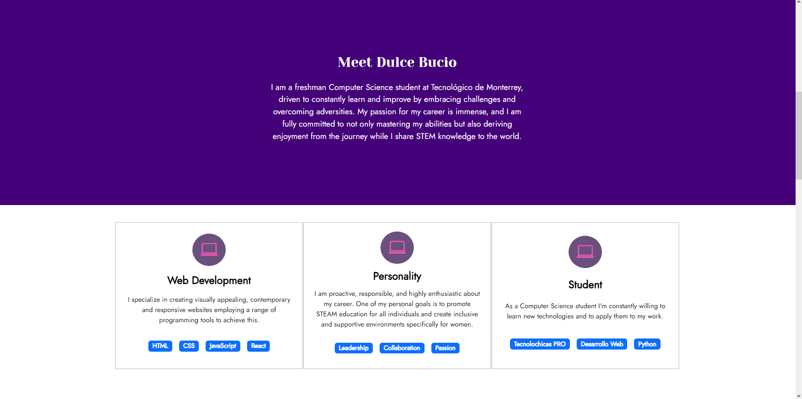
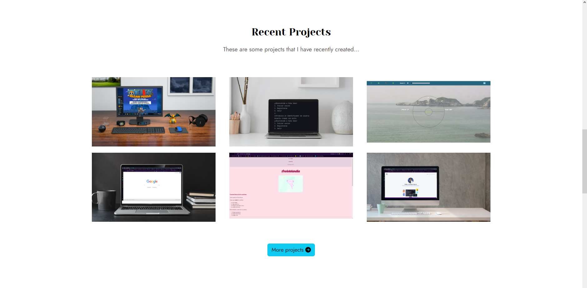
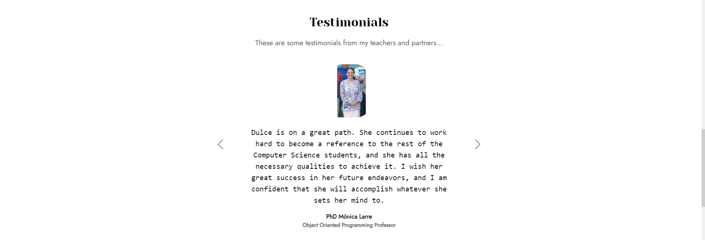
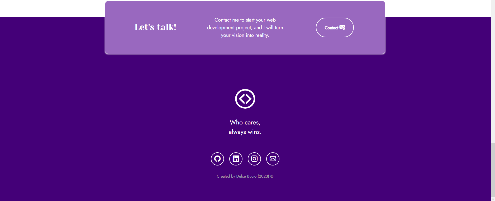

# Responsive Portfolio with Bootstrap 5

This project, created for the Tecnolochicas PRO bootcamp, is a website that is adaptable to devices of different sizes, commonly referred to as a "responsive" website.

The purpose of this website is to showcase a developer's portfolio of projects and their experience. It includes a brief description of their motivation, experience, projects, published articles, and contact information.

It also includes alternative images in the imagenes folder in case customization of the developer's main image is desired, along with JavaScript-powered page typing animation.

### Screenshots:

First part of the website:

Experience:

Projects:

Testimonials:

Contact:

## Technologies
This website was created using:

HTML
CSS
JavaScript
Bootstrap 5
Additionally, it includes Google Fonts for font customization and Bootstrap icons to incorporate icons such as arrows and popular social media logos.

